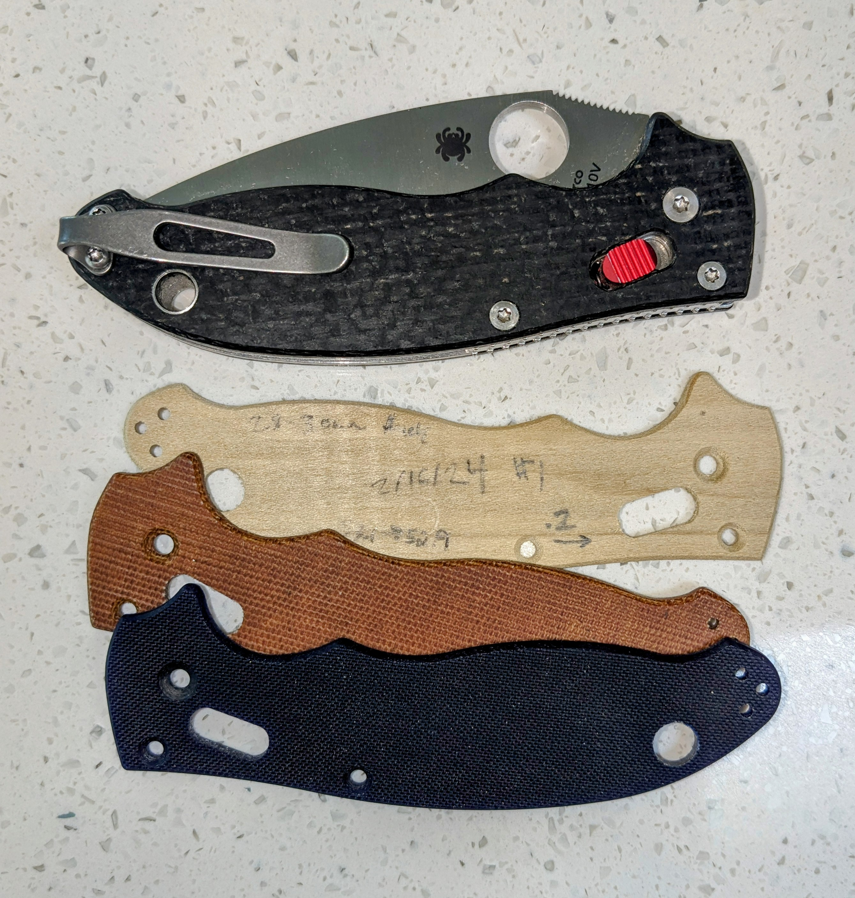

# Spyderco Manix 2

The manix is one of the easiest scales to make. It is basically a flat
scale with no milling on the inside. The scale is 2.6 mm thick, with
a very slight bevel on the edge. The knife is held together by two screws
and the pivot, and has a reversible clip.

The lanyard is 7.6mm. The pivot looks to be about 3.65mm.
The front and mid screws are about 3.0mm.

The stock for this scale must be at least 1.5". It's a tight 
fit on that size. But that's what size I typically get mine in
so I made it work.

## Setup

This is a one-sided scale. I prep this with blue painters
tape on one side, then use a spray adhesive to secure it 
to some waste board of the same size as the scale.

Because this scale barely fits in 1.5", it needs to be lined
up exactly. Put a bit in and lower it below the stock near the
bottom left edge. Position the stock so it touches the bit and 
lightly secure the left edge. Then move the bit to the 
bottom right. Push the right edge down until it is touching the
bit and lightly secure. Go back and forth a few times to make
sure that the piece is closely alined with your X axis.

Now raise the bit to about the level of the piece. Position it
so that its center is on the lower edge. It should be about a
centimeter right of your left clamp. This will be the home
position for all of the passes.

## One pass method

If you have a piece of stock that is the correct thickness, this
scale is very easy to cut, requiring only one tool change.

I use a 2mm endmill for everyghind other than the chamfers. 
Basically I just have that tool cut all the holes and the part.
The rest is done with a 6mm, 90 degree chamfer bit. The 
pivot is chamfered to 1.7mm. The other two chamfered screw
holes go to 1.3mm. The part is chamfered to 1mm. That's it!

## Doing it the hard way

For a while I struggled to find a way to get my (generally 1/8")
stock to the appropriate thickness. I ended up using this fairly
complicated process for a while and have left it here in case
it is useful to anyone. But this is not recommended.

### First Pass

If your stock is thicker than 2.6mm, you can  
get it down to size here. I use a 6mm compression bit. The first pass 
is a pocket of the entire scale shape to get it to the desired 
depth. A few of the corners are smaller than 6mm so make sure
to overcut these.

Next, we will cut out the part. Because of the way estlcm
works, I do this in two parts. First, do a part cut down to 
the depth that you used for the sizing above. If you did 
not need to adjust the depth of your piece, you will not need
to do this. 

Next, do another part cut. This one starts at the depth
of the pocket, or at 0 if you did not need a pocket.
The edge chamfer should be 1.0 with the 90 degree bit.

If you are using a 6mm bit like I am, you can also cut 
the lanyard hole and the lock hole here. 

Here, I'm sticking with the 6mm compression, followed by the
90 degree bit for the bevel.

### Second pass (the remaining holes)

Uses a 2mm mill for the holes. Then a 90 degree for the chamfers.
For pivot screw chamfer depth of 1.6mm. For the other two
I used a depth of 1.2.